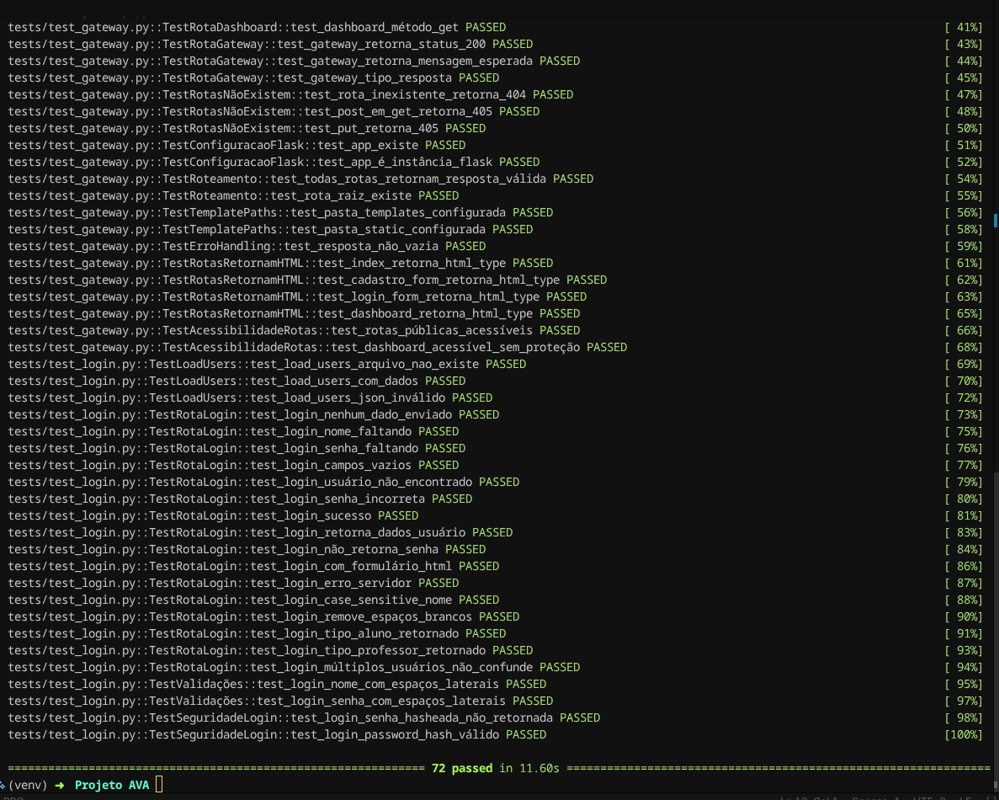

# Sprint Backlog

## Sprint 1 - Login e Cadastro [RF01/RF02] (Inicio: 02/05/2026 - Fim:  05/05/2026)

- Fazer o diagrama de casos de uso do sistema de login e cadastro (Diagrama de Caso de Uso 1.png)
- Fazer o diagrama de componentes desse sistema
- Implementação:
    - implementação do gateway
    - criação das páginas html e css referentes a RF01/RF02 (cadastro, dashboard, login e pag_inicial)
    - implementação do login.py e do cadastro.py
- teste unitário dos mesmos

## Sprint 2 - Turmas e Aulas [RF04/RF05/RF07] (Inicio: 05/05/2026)

- Fazer o diagrama de sequência do sistema de Turmas e Aulas
- Fazer o diagrama de componentes desse sistema isolado (foi feito o RF07 junto no diagrama para facilitar o entendimento)
- Implementação:
    - implementação das turmas(06/05 - 08/05)